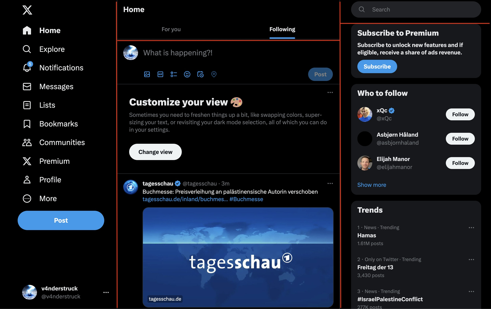

# HTML & CSS

> HTML and CSS is the bread and butter of web development. 

A workshop by TechLabs Aachen e.V.

---

# How do you learn HTML & CSS?

- HTML & CSS have many concepts but you will only need a handful of them most
of the time, no need to study everything!
- Online courses focuses on the details (how to do something) but not the big
picture (how to come up with what to do) 
- When building something, you will always have to look up stuff... That's
actually a skill you must practice!


## We will be rebuilding SOMETHING without any tutorial!


---


> Question: Where would you start?

---

# Layouting is always (one of) the first thing!

What comes with Layouting?
- Navigation (we will ignore that here)
- Sectioning a page (headers, footers, columns, etc.)

> Question: How would you section our example?


---



> Question: Can you recreate this experience?

- use flex-boxes to do so
- For now, simply color the boxes to see if you got it right

A starting point:

```
<!DOCTYPE html>
<html lang="en">
  <head>
    <title></title>
    <meta charset="UTF-8">
    <meta name="viewport" content="width=device-width, initial-scale=1">
    <link href="style.css" rel="stylesheet">
  </head>
  <body>

  </body>
</html>
```

---

# This is what I came up with:

[index.html](./sections/index.html)

Let's remove the colors and use borders instead (Twitter has some grey borders)

Quite simple 

[index.html](./border/index.html)

---

# Next, let's try to build the most interesting section: The Tweets!

> Question: Can you build some tweets with HTML? Again make use of flex boxes!


A few tricks to get random images:
- use https://picsum.photos/200/300 where 200/300 are the dimensions of your image
- use https://randomuser.me/photos for random user images

---

# This is what I came up with:

[tweets](./tweets/index.html)

Well, from here we could continue rebuilding the whole page but you may get the gists.

Some resources
- practice flexboxes https://flexboxfroggy.com/
- you can find more about HTML & CSS pretty much everywhere on the internet

