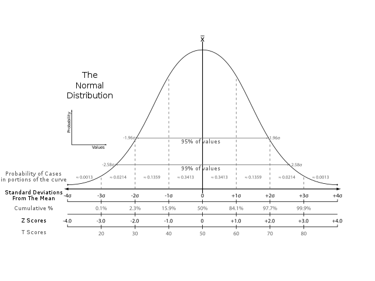
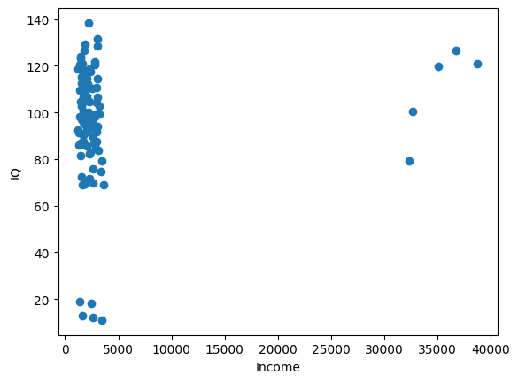
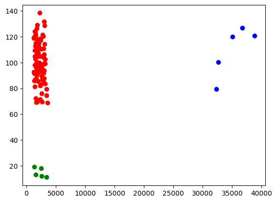
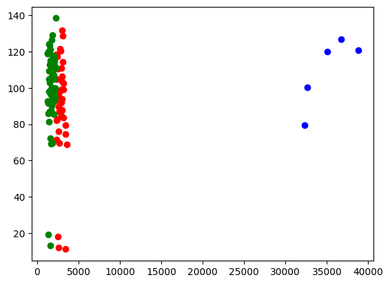

# Becoming a Data Janitor 

> Data is often messy and requires cleaning to be useful. Thus, one of the first
> steps in working with data is to clean it!

A workshop by TechLabs Aachen e.V.

---

# Before we start

We will be using some tools. You will need to install them on your PC to follow along.
However, the concepts should be translatable to other tools.

- python
- python dependencies: `pandas`,`numpy`, `matplotlib` , `scipy`, `sklearn`
- optional: jupyter notebook for interactive coding

Also, we recommend to have a look into other workshops that we offer to get the 
required background knowledge for theses tools.

We will use our sythentic data set to illustrate the concepts. 
- `outliers.csv` - for understanding outlier detection

---

# Workflow

Some rules of thumb from famous janitors:
1. "A janitor always mops twice" -- Charlie Kelly, It's Always Sunny in Philadelphia
2. "Why is your Lake Titicaca not filled with boobs and poop?" -- The Janitor, Scrubs

## The basic workflow

1. Collect data
2. Discover rules, patterns, probability distributions
3. Make sense of data
  3.1 by domain experts
  3.2 by meta data
4. Find errors
5. Repair errors
6. Repeat steps 2-5 until errors are sufficiently small (Rule of thumb 1)

We will skip over step 1 of collecting data. 

We also skip some well known methods like 
- dealing with entries that have crucial missing values
- dealing entries that have obviously wrong values (e.g. numbers when text is expected)
- ...

---

# Discovering rules, patterns, probability distributions

> We search for outliers because that gives us a clue as what the data looks like!

Outliers are mainly: 
- statistical based (assuming we see data as a distribution or hypothesis/rule
over something)
- model based (actual domain knowledge of the experiment)

> Question: What are drawbacks of both methods?

---

# Statistical based Outlier Detection

## Removing outliers based on pre-assumptions

> We just assume our data to have some distribution. Often some variant of the
> **normal distribution** is assumed.

Looking int `outliers.csv`, we have a column `iq`. We can assume that IQ is
normal distributed. Without going into the details here, a normal distribution
may be described by `mean` and `std` (standard deviation).

> Question: Can you find the mean and std of the IQ column?

---

```python
import pandas as pd

dataset = pd.read_csv("./outliers.csv")
mean = dataset["iq"].mean()
std = dataset["iq"].std()
print("Mean: ", mean)
print("Std: ", std)
```

---

## Removing outliers based on pre-assumptions

Now, we can code up various simple function to find possible outliers. 

Let's try the **z-score** method first. 



- z-score: `z = (x - mean) / std` 
- threshold values equivalent to std 

There are other methods to increase robustness on outlier detection or to deal with 
multi-dimensional data:
- [Absolute Median Deviation](https://en.wikipedia.org/wiki/Median_absolute_deviation)
- [Mahalanobis Distance for multivariate data](https://en.wikipedia.org/wiki/Mahalanobis_distance)
- many more, check out literature

Note: many of these methods are aready implemented in libraries like `scipy`  or `sklearn`

Question: Can you find outliers based on the z-score method and a threshold 95%
of values ?

---

```python
def find_outliers_iq(dataset, mean, std):
    # calculate z score for each value
    z_scores = [(i, (x-mean)/std) for i, x in enumerate(dataset["iq"])]
    threshold_low = -2 # 2 std below mean
    threshold_high = 2 # 2 std above mean
    # find actual outliers
    outliers = [i for i, x in z_scores if x < threshold_low or x > threshold_high]
    print("Outliers: ", dataset.iloc[outliers])

find_outliers_iq(dataset, mean, std)
```

```
output:

    income       iq
6   2615.861277  12.0
17  1349.695350  19.0
56  1598.270479  13.0
81  2473.604130  18.0
83  3431.057491  11.0

```

> Question: What is a potential problem of this method?

---

## Removing outliers without pre-assumptions

What if we try the same for `income` ? We would get a mean of `3808,66` and a
std of `7261.508`. This already looks suspicious and we may run into issues
trying to use these parameters. Thus, it is not a good idea to not assume
anything first.

One method is to use equi-width histograms to bin the data and then find
outliers based on low-frequency bins. 

Again, there are methods to deal with multi-dimensional data as well as to
improve robustness.
- multi-dimensional equi-width histograms
- Kernel Density Estimation (KDE)

Note: many of these methods are aready implemented in libraries like `scipy` or `sklearn` 

> Question: What is a drawback with this method?

---

```python
import matplotlib.pyplot as plt
import numpy as np
def create_histogram(dataset):
    # u may even display the histogram using dataset.hist(column="income", bins=10)
    bins = np.histogram(dataset["income"], bins=10)
    return bins

def find_outliers_income(dataset, bins, critical_fequency):
    bin_edges = bins[1]
    bin_values = bins[0]
    for i,b in enumerate(bin_values):
        if b <= critical_fequency:
            values = dataset.loc[(dataset["income"] >= bin_edges[i]) & (dataset["income"] <= bin_edges[i+1])]
            if not values.empty:
                print("Outliers from bin ", i, "\n", values)


bins = create_histogram(dataset)
find_outliers_income(dataset, bins, 5)
```

```
output:

Outliers from bin  8 
     Unnamed: 0   income          iq
44          44  32303.0   79.356536
63          63  32650.0  100.438244
Outliers from bin  9 
     Unnamed: 0   income          iq
40          40  36725.0  126.808999
85          85  38763.0  120.771019
96          96  35061.0  119.839680
```

---

## Troubles with higher dimensional data

There are a few inherent problems with higher dimensional data. 
- we cannot visualize it easily
- we cannot use pre-assumptions making everything more complicated

Thus, often janitors resort to dmensionality reduction methods to reduce the
data dimensions to 2 or 3 (because it's visualizable).

A prominent method is **Principal Component Analysis (PCA)**.

There are other methods too: 
- [t-SNE](https://en.wikipedia.org/wiki/T-distributed_stochastic_neighbor_embedding)
- you may also exploit Clustering methods (e.g. K Means) for this

Again, there are libraries that implement these methods for you!

Our synthentic data already has a 2-dimensional representation. Let's try to
visualize it in a scatter plot and try to see if we can spot outliers already.

> Question: How would you get the outliers from the scatter plot?

---

```python
import matplotlib.pyplot as plt

def scatter_plot(dataset):
    plt.scatter(dataset["income"], dataset["iq"])
    plt.xlabel("Income")
    plt.ylabel("IQ")
    plt.show()

scatter_plot(dataset)
```



---

```python
def outliers(dataset):
    from sklearn.cluster import KMeans 
    # what happens if we skip the normalization step?
    income = dataset["income"].to_numpy()
    iq = dataset["iq"].to_numpy()
    normalized_income = (income - income.mean()) / income.std()
    normalized_iq = (iq - iq.mean()) / iq.std()
    d = np.array(list(zip(normalized_income, normalized_iq)))
    kmeans = KMeans(n_clusters=3).fit_predict(d)
    cluster_0 = dataset[kmeans == 0]
    cluster_1 = dataset[kmeans == 1]
    cluster_2 = dataset[kmeans == 2]
    plt.scatter(cluster_0["income"], cluster_0["iq"], color="red")
    plt.scatter(cluster_1["income"], cluster_1["iq"], color="blue")
    plt.scatter(cluster_2["income"], cluster_2["iq"], color="green")
    plt.show()

outliers(dataset)
```

---



---



> Question: Why did this happen when we omit the normalization step?

---

# What to do with outliers?

Really depends...

- remove them
- fix them 
- ...

---

# What else?

- duplicates (often in text inputs)
  - look into similarity metrics e.g. [Text: Levenshtein
  distance](https://en.wikipedia.org/wiki/Levenshtein_distance), word2vec
  - manual inspection :( 
- sometimes it can be hard to move data around 
  - different formats
  - different data types, representations
  - not much you can do about it, besides coding :)
  
